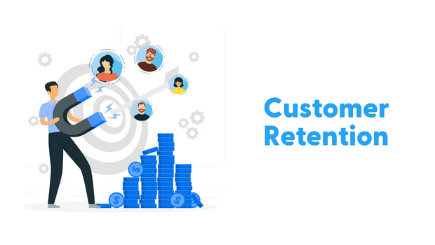
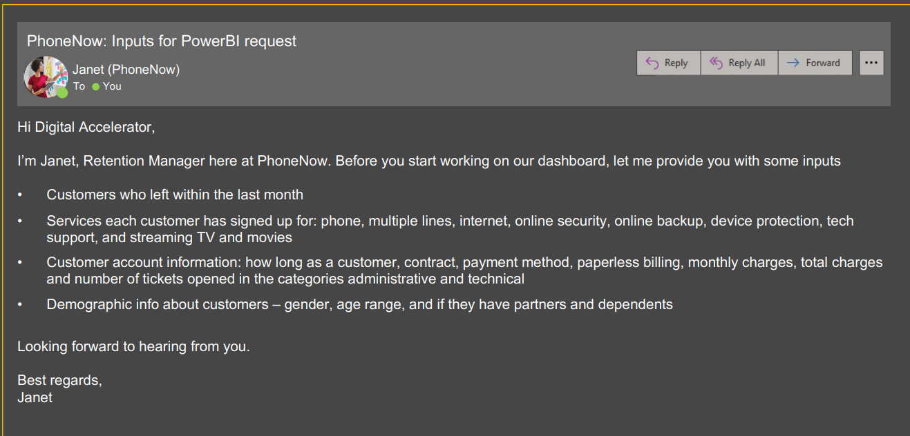
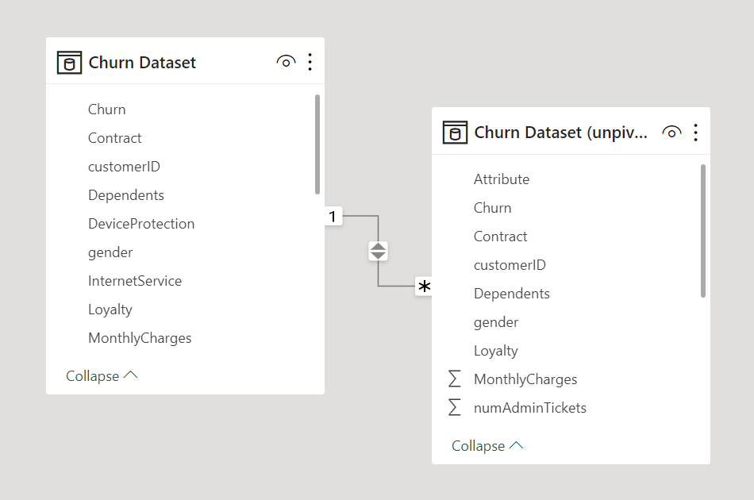
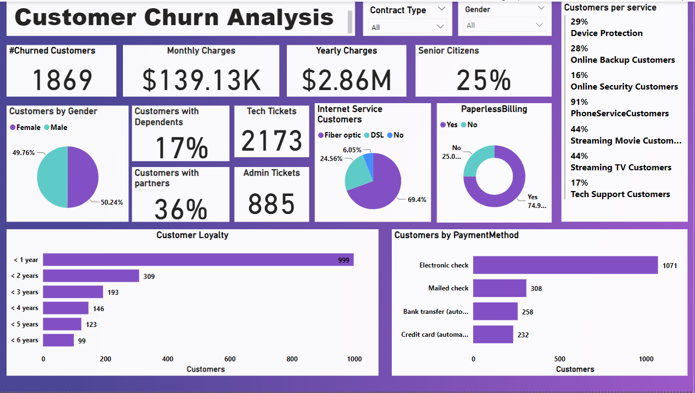
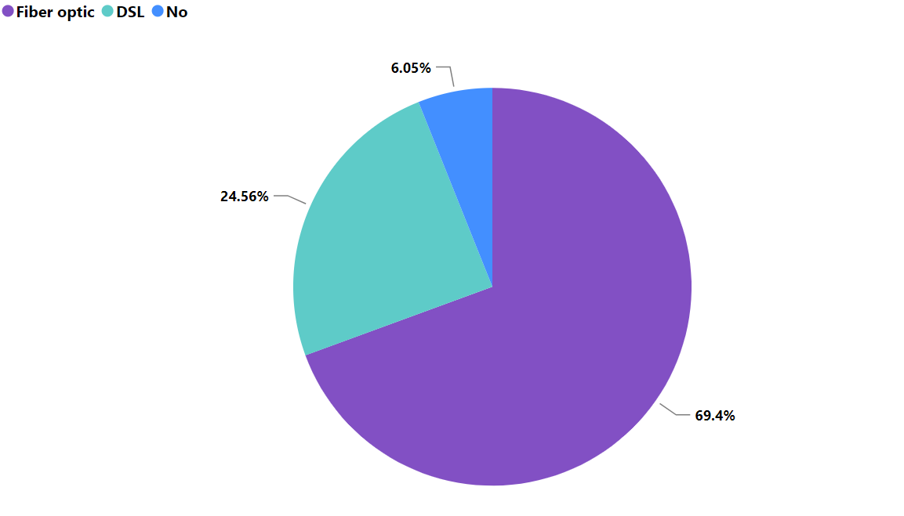
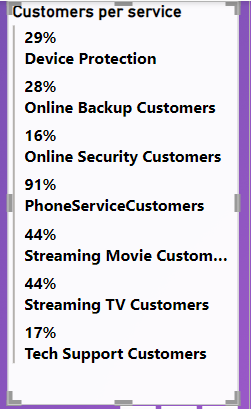
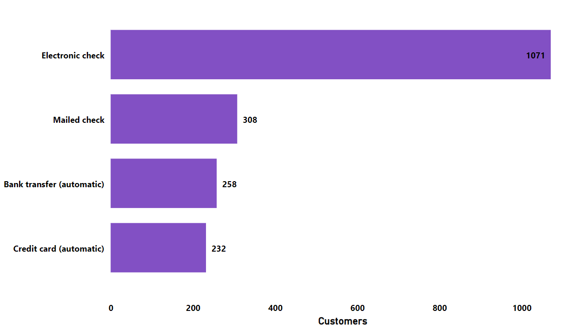
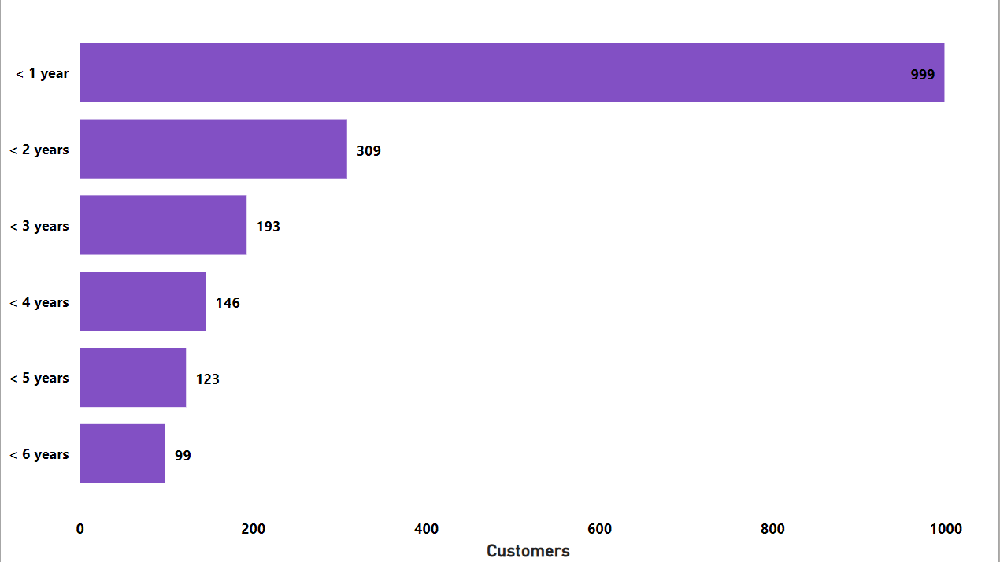

# Customer-Retention

This report details the development and features of the Customer Retention Dashboard, designed to provide actionable insights and support strategic decision-making aimed at improving customer loyalty and reducing churn.

# Introduction

After presenting the Customer Analysis dashboard in my previous repository to the management, they were impressed by the insights and clarity of the previous work. The next task is to create a new dashboard specifically focused on customer retention.
## Problem Statement

The Retention Manager at PhoneNow has requested the development of a PowerBI dashboard to analyze customer retention, focusing on those who left within the last month. The dashboard should include detailed information on services subscribed, customer account details, and demographic data to identify patterns and factors influencing churn.

## Skills Demonstrated

- **Defining KPIs**
- **Insights and Actions**
- **Calculating Measures**
- **DAX**
- **Dashboard Creation**
- **Power BI Visualization**

## Data Sourcing

The Churn dataset was provided during the internship. It was available in the xlsx file format and was imported into Power BI for analysis. This Churn dataset has 23 columns and 7043 rows.

### Column Names

1. **customerID**: A unique identifier for each customer.
2. **gender**: The gender of the customer (e.g., Male, Female).
3. **SeniorCitizen**: Indicates whether the customer is a senior citizen (1 for Yes, 0 for No).
4. **Partner**: Indicates whether the customer has a partner (Yes or No).
5. **Dependents**: Indicates whether the customer has dependents (Yes or No).
6. **tenure**: The number of months the customer has stayed with the company.
7. **PhoneService**: Indicates if the customer has phone service (Yes or No).
8. **MultipleLines**: Indicates if the customer has multiple lines (Yes, No, or No phone service).
9. **InternetService**: The type of internet service the customer has (e.g., DSL, Fiber optic, No).
10. **OnlineSecurity**: Indicates if the customer has online security service (Yes, No, or No internet service).
11. **OnlineBackup**: Indicates if the customer has online backup service (Yes, No, or No internet service).
12. **DeviceProtection**: Indicates if the customer has device protection service (Yes, No, or No internet service).
13. **TechSupport**: Indicates if the customer has tech support service (Yes, No, or No internet service).
14. **StreamingTV**: Indicates if the customer has streaming TV service (Yes, No, or No internet service).
15. **StreamingMovies**: Indicates if the customer has streaming movies service (Yes, No, or No internet service).
16. **Contract**: The type of contract the customer has (e.g., Month-to-month, One year, Two year).
17. **PaperlessBilling**: Indicates if the customer uses paperless billing (Yes or No).
18. **PaymentMethod**: The payment method used by the customer (e.g., Electronic check, Mailed check, Bank transfer (automatic), Credit card (automatic)).
19. **MonthlyCharges**: The amount charged to the customer monthly.
20. **TotalCharges**: The total amount charged to the customer.
21. **numAdminTickets**: The number of administrative tickets raised by the customer.
22. **numTechTickets**: The number of technical support tickets raised by the customer.
23. **Churn**: Indicates if the customer has churned (Yes or No), meaning whether the customer has left the service.

## Data Transformation

The dataset required several significant transformations to ensure it was ready for analysis. Here are the changes made to the data:

1. Promoted the first row to headers and ensured all scalar values were promoted.
2. Changed the data type of the "TotalCharges" column to a numeric type.
3. Renamed the "tenure" column to "tenure (in months)".
4. Added a "Loyalty" column to categorize customers based on their tenure duration.
5. Removed duplicate entries based on "customerID" to ensure data uniqueness.
6. Converted the "SeniorCitizen" column to an integer type.
7. Unpivoted the dataset for columns related to services (e.g., PhoneService, InternetService), creating "Attribute" and "Value" columns for better analysis.

These transformations were necessary to clean, standardize, and structure the data effectively for the retention analysis.

## Modelling

This Churn dataset table connects to the unpivoted churn dataset on a one-to-many relationship.

## Customer Churn Analysis Report (Page Filtered for Churned Customers)

Based on the problem statement above, here is the analysis of the churn dashboard, focusing on the filtered data for churned customers. Understanding the behavior of this specific group is crucial for devising targeted strategies to reduce churn. Let’s explore the key findings:

### Key Findings for Churned Customers

1. **Gender Distribution**:
   - Out of the **7,043** customers analyzed, **1,869** churned: **49.76%** are female, and **50.24%** are male.
2. **Senior Citizens and Customers with Dependents**:
   - 25% of churned customers are older adults.
   - 17% of customers have dependents.
3. **Internet Service Impact**:
   - The majority of churned customers were using Fiber Optic internet service.
   - We need to investigate why Fiber Optic users are more prone to churn.

**Internet Service Customers**

4. **Service Adoption and Churn**:
   - Customers with Online security and Tech support services exhibit lower churn rates.
   - Promoting these services could help reduce churn.

5. **Payment Methods and Churn**:
   - The horizontal bar chart for “Customer Loyalty” highlights varying loyalty durations.
   - Payment methods such as electronic check and mailed check correlate with higher churn. The highest number of customers who churned used the above payment methods.

6. **Customer Tenure**:
   - The dashboard shows the number of customers by how long they have been customers. The largest group of customers (999) who churned have been customers for less than a year.

## Recommendations for Churn Reduction

1. **Targeted Communication**:
   - Tailor communication to address the needs of different customer segments (e.g., seniors, Fiber Optic users).
   - Highlight the benefits of Online security and Tech support services.
2. **Loyalty Programs**:
   - Implement loyalty programs to encourage longer-term commitments.
   - Incentivize customers to stay by offering discounts or exclusive services.
3. **Payment Method Optimization**:
   - Encourage customers to switch from high-churn payment methods (e.g., electronic check) to more stable options (e.g., credit card).
   - Simplify payment processes to reduce friction.
4. **Customer Support Enhancement**:
   - Investigate the reasons behind customer support tickets related to churn.
   - Improve support processes to address customer concerns promptly.

## Conclusion

By focusing on the specific needs of churned customers and implementing targeted strategies, Phone now can enhance retention rates and drive long-term success. If you have any further questions or need additional insights, ‌reach out on https://x.com/SJaelhard 😊

